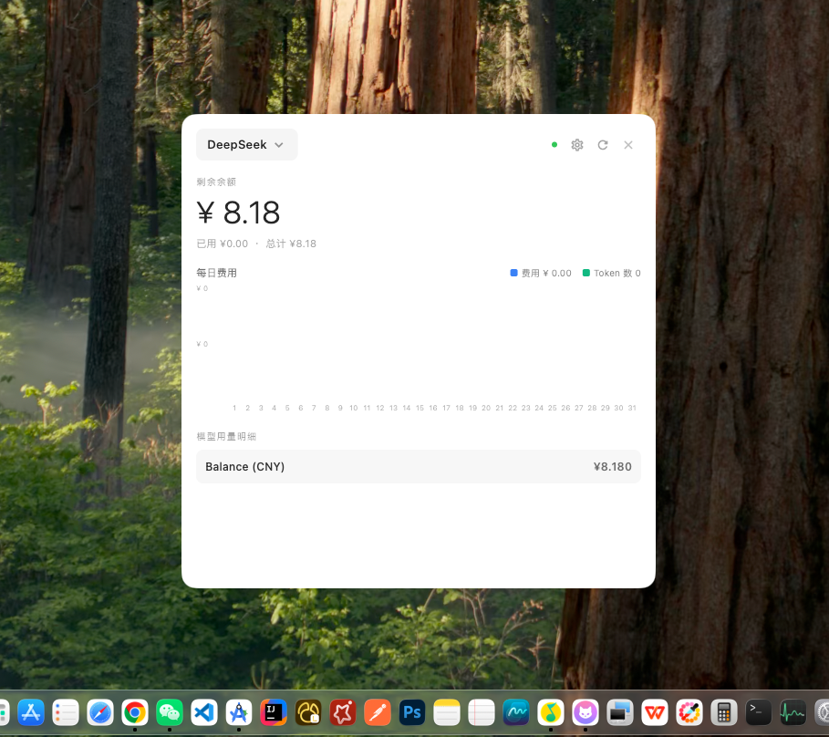

# koko 

[English](README.md) | [中文](README_zh.md)

> A minimalist menu-bar / system tray tool to monitor your LLM provider balances — DeepSeek, OpenAI, and any OpenAI-compatible API.

---

## Screenshots

| Dashboard | Tray Popup |
|---|---|
|  |  |

## Features

- **System tray integration** — Lives in your macOS menu bar or Windows system tray. Click to see your balance at a glance, hide on blur.
- **Two views** — Compact popup (balance only) and full dashboard with charts and model breakdown.
- **Multi-provider** — Switch between DeepSeek, OpenAI, or add custom OpenAI-compatible endpoints.
- **Balance monitoring** — Remaining balance, total used, and total topped-up with currency detection (USD/CNY/EUR/GBP).
- **Daily cost chart** — Bar chart of daily spend for the current month.
- **Model breakdown** — Per-model cost breakdown from the usage API.
- **Local persistence** — API keys and provider configs stored locally via `shared_preferences`.

## Supported Platforms

| Platform |
|----------|
| macOS    |
| Windows  |

## Tech Stack

| Dependency | Purpose |
|---|---|
| `window_manager` | Frameless, always-on-top window management |
| `tray_manager` | System tray / menu bar icon and menu |
| `dio` | HTTP client for provider APIs |
| `fl_chart` | Daily cost bar chart |
| `shared_preferences` | Local key-value storage |

## Project Structure

```
lib/
├── main.dart                  # App entry, window/tray management, view switching
├── models/
│   └── provider_model.dart     # ProviderConfig, BalanceResult, ModelUsage, DailyUsage
├── services/
│   ├── api_service.dart        # DeepSeek & OpenAI balance/usage API calls
│   └── storage_service.dart    # SharedPreferences persistence layer
└── ui/
    ├── dashboard_view.dart     # Full dashboard with charts & model breakdown
    ├── settings_view.dart      # Add / edit / delete provider configs
    └── tray_popup_view.dart    # Compact balance popup
```

## Getting Started

### Prerequisites

- [Flutter SDK](https://docs.flutter.dev/get-started/install) >= 3.10.7
- macOS / Windows desktop development enabled (`flutter config --enable-macos-desktop` / `flutter config --enable-windows-desktop`)

### Development

```bash
git clone <repo-url> && cd koko
flutter pub get
flutter run -d macos    # or windows
```

### Build

```bash
# macOS
flutter build macos

# Windows
flutter build windows
```

## Configuration

On first launch, two default providers are seeded:

- **DeepSeek** — `https://api.deepseek.com`
- **OpenAI** — `https://api.openai.com`

### Adding a provider

1. Open the dashboard and click **Preferences**.
2. Tap the **+** button to add a new provider.
3. Fill in:
   - **Name** — e.g. `My Proxy`
   - **Base URL** — Any OpenAI-compatible endpoint (e.g. `https://api.openai.com`, `https://api.deepseek.com`, or a custom proxy).
   - **API Key** — `sk-...`
4. Save and switch to the new provider via the dropdown on the dashboard.

### Supported API formats

| Provider | Balance Endpoint | Usage Endpoint |
|---|---|---|
| DeepSeek | `GET /user/balance` | `GET /v1/usage/metrics` |
| OpenAI | `GET /v1/organization/costs` | `GET /v1/usage` |
| Custom | Auto-detects DeepSeek or OpenAI style | Falls back to whichever succeeds |

OpenAI billing requires an **Admin API key** created at [platform.openai.com → Settings → Admin Keys](https://platform.openai.com).
